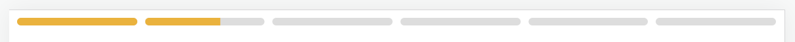

# Домашнее задание к лекции ШРИ - мультимедиа (2024)

На сегодняшний день сториз стали одним из самых успешных медиаформатов.
Реализация этого формата в вашем проекте может увеличить вовлеченность аудитории.
Так же, это мощный инструмент продаж, используемый разными площадками и приложениями.

У вас есть отличная возможность попробовать с нуля реализовать формат сториз, чтобы закрепить на практике лекционный материал и разобраться, как реализуются подобные медиаинструменты без использования сторонних библиотек.

Страница должна работать в актуальной версии Chrome на десктопе и
на Android/iOS (достаточно одной платформы – укажите в описании ДЗ, на какой ОС вы отлаживались).

Можно использовать подход mobile first, чтобы много не верстать под десктоп.

### Чтобы запустить шаблон:
```bash
npm i
npm run start
```

## Что нужно реализовать
#### Интерфейс страницы:

   - При открытии страницы пользователь должен видеть первый слайд сториз. Видео для слайдов находятся [здесь](assets/).
   - Контролсы, дающие возможность переключаться между слайдами, открывать панель выбора реакций, а так же воспроизводить или ставить видео на паузу.
   - Возможность оставить реакцию на любой из слайдов сториз. (см. [пример](examples/example-reactions-bar.png))
   - Сверху отображается прогресс-бар, по которому можно понять, какой слайд воспроизводится и оставшееся время до перехода к следующему:
   

#### Функциональные требования:

   - Сториз имеют вертикальную ориентацию.
   - Адаптивность встраиваемого видео (Задаём максимальную ширину для видео ручками, высота должна автоматически подстроиться так, чтобы не поломалась пропорция соотношения сторон видео).
   - По окончании видео происходит автоматический переход к следующему слайду, видео в нём автоматически запускается.
   - Анимация переключения слайдов должна работать без заметной просадки FPS на странице.
   - Прогресс-бар должен ползти без тормозов. После проигрывания последнего слайда отсчет времени останавливается.
   - Во время выбора реакции видео должно быть на паузе. Фон должен быть затемнённым.
   - После клика по реакции убирается затемнённый фон, запускается анимация, видео воспроизводится дальше.
   - Предусмотреть мисклики по затемнённому фону.

## Формат сдачи

Это задание для тех, кто заинтересован попробовать изученный материал на практике, проверки как в предыдущих домашних заданиях не будет.

Чуть позднее мы поделимся решением, с которым можно сопоставить своё :)
